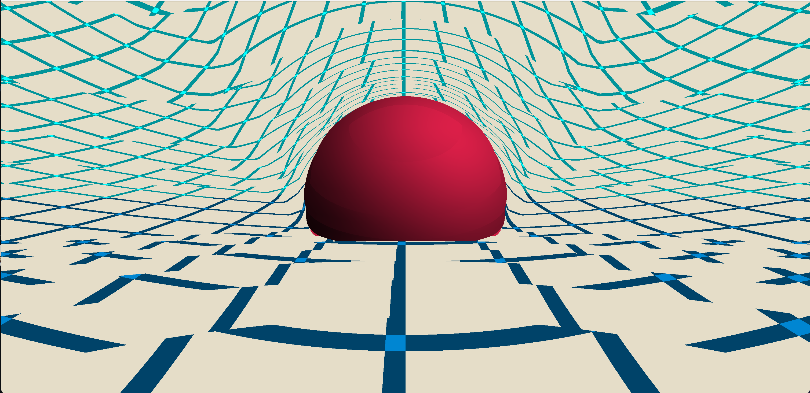

# OpenGL-Raymarching
Raymarching shader in openGL as my first actual project in openGL (first one being the "Hello World" of computer graphics, drawing a triangle!)

Currently learning c++, openGL, and GLSL.

If you want to run the code, make sure you have C++ addons for VS Code and clang++ compiler. More info can be found here https://code.visualstudio.com/docs/cpp/config-mingw#_prerequisites

Here is the resulting rendered iamge.

